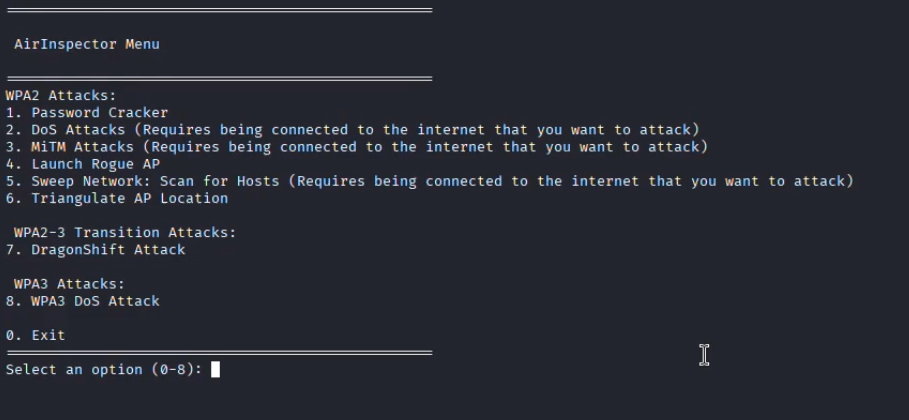
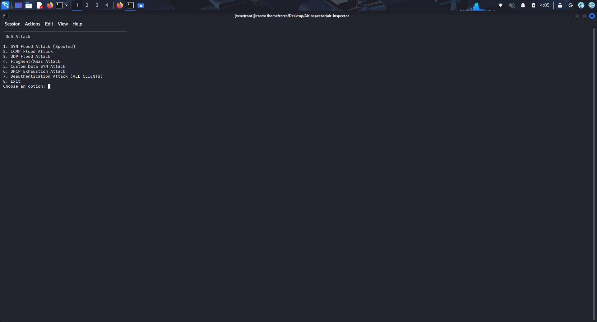

# AirInspector - by KanekiLor

AirInspector is a Linux-based offensive wireless and network attack framework that automates multiple Wi-Fi and LAN attack workflows from a single terminal interface.

The project combines WPA2 handshake capture and cracking, denial-of-service attacks, man-in-the-middle attacks, rogue access point deployment, local network sweeping, access point triangulation, WPA2/WPA3 transition analysis, and WPA3-specific denial-of-service techniques.

The application is designed to run on systems with direct access to wireless interfaces, monitor mode support, and packet injection capability.


## Important Notice

This repository contains offensive network functionality. It must only be used in controlled environments, lab setups, capture-the-flag scenarios, or against systems for which explicit authorization has been granted.

The software launches real attack workflows and depends on external tools commonly used in penetration testing and wireless exploitation.

## What the Project Actually Does

AirInspector is a menu-driven launcher for multiple attack modules.

The main menu in main.py exposes the following options:

1. Password Cracker
2. DoS Attacks
3. MiTM Attacks
4. Launch Rogue AP
5. Sweep Network: Scan for Hosts
6. Triangulate AP Location
7. DragonShift Attack
8. WPA3 DoS Attack

Under the hood, each option starts a dedicated Python module from its own folder.

## Recommended Platform

The project is intended for Linux and is best suited for:

- Kali Linux
- Parrot OS

Kali Linux is the recommended environment because most of the external dependencies used by the project are either already available or easy to install from the default repositories.

Running the project on Ubuntu or another Debian-based distribution is possible, but requires more manual setup.

## Hardware Requirements

To use the wireless attack modules properly, you need a wireless adapter that supports:

- monitor mode
- packet injection

A USB adapter based on chipsets such as Atheros AR9271 is a practical choice for this type of project.

Some features, such as DragonShift, require more than one wireless interface because one interface is used for rogue AP hosting and another for monitor mode and deauthentication.


## Architecture

AirInspector is not a monolithic implementation of all attacks. It acts as a controller that dispatches execution to specialized Python modules, and those modules in turn invoke external Linux tools.
```
                           +------------------+
                           |     main.py      |
                           |  Main menu and   |
                           | dependency check |
                           +---------+--------+
                                     |
        ----------------------------------------------------------------
        |              |              |             |          |         |
        v              v              v             v          v         v
+---------------+ +-------------+ +-----------+ +----------+ +--------+ +------------------+
|  wpa2_crack   | | Wpa2   DoS  | |Mitm Attack| | Evil Twin| | Sweep  | |   Triangulation  |
+-------+-------+ +------+------+ +-----+-----+ +-----+----+ +----+---+ +---------+--------+
        |                |              |              |           |               |
        v                v              v              v           v               v
 aircrack-ng       hping3 / Scapy   nmap /         hostapd /    nmap /         Scapy
 airodump-ng       aireplay-ng      bettercap      dnsmasq /    nmcli          sniffing
 aireplay-ng                                       iptables                     RSSI analysis

                                     |
                                     |
                                     v
                          +----------------------+
                          | WPA3 attack modules  |
                          | Wpa3_DOS             |
                          | Wpa3_DragonBLood     |
                          +----------+-----------+
                                     |
                                     v
                        airodump-ng / airmon-ng / iw / Scapy /
                        hostapd-mana / crafted SAE traffic
```
## Installation
1. Clone the repository
   text
    git clone https://github.com/KanekiLor/air-inspector.git
    cd air-inspector
   
2. Install Python dependencies
   text
   pip install -r requirements.txt
   
3. Install required system tools
   On kali or Debian-based systems:
   text
    sudo apt update
    sudo apt install -y \
    aircrack-ng \
    iw \
    wireless-tools \
    net-tools \
    iptables \
    network-manager \
    dnsmasq \
    hostapd \
    nmap \
    ettercap-graphical \
    bettercap \
    hping3 \
    php \
    xterm \
    tshark
    
For the code currently present in the repository, the project relies on these external tools:
ip, iw, iwconfig, ifconfig, iptables, nmcli, systemctl, xterm, php, tshark, airodump-ng, aireplay-ng, aircrack-ng, airmon-ng, hostapd, hostapd-mana, dnsmasq, hping3, bettercap, nmap
## Running the Project
The main launcher must be executed with root privileges:
text
  sudo python3 main.py

Root privileges are required because the project manipulates interfaces, monitor mode, iptables rules, packet capture, packet injection, and traffic interception.

## Menu Options and Real Behavior




### 1. Password Cracker

Module: wpa2_crack/main.py

This module performs WPA2 handshake capture followed by offline password cracking.

The workflow starts by selecting a wireless interface and enabling monitor mode. The system scans nearby wireless networks using airodump-ng and parses the generated CSV output. The user selects a target access point (ESSID), after which the module identifies connected clients.

The tool then begins capturing traffic on the target BSSID and channel. Deauthentication frames are continuously sent using aireplay-ng to force clients to reconnect, capturing a valid WPA2 handshake.

Once a handshake is detected, aircrack-ng is executed to attempt password recovery using a predefined wordlist (rockyou.txt).


External tools used:
- airmon-ng
- airodump-ng
- aireplay-ng
- aircrack-ng

Important notes:
- Requires active clients connected to the target network
- Cracking depends on the quality of the wordlist
- Uses rockyou.txt by default


### 2. DoS Attacks

Module: DoS_Hping3/main.py

This module provides multiple denial-of-service attack methods targeting both network infrastructure and wireless environments.

Available attack types include:
- SYN flood with spoofed IP addresses
- ICMP flood
- UDP flood
- Fragmentation/Xmas-style flood
- SYN flood with custom payload
- DHCP exhaustion attack
- Wi-Fi deauthentication attack

The module allows selection of an interface and automatically detects the default gateway. During execution, one thread monitors target responsiveness and latency and the other thread executes the attack.

The DHCP exhaustion attack uses Scapy to repeatedly send DHCP Discover and Request packets with randomized MAC addresses in order to consume and secure all available leases.

The Wi-Fi deauthentication attack scans nearby access points, identifies clients, and starts a different thread for each client which continuously sends deauthentication frames using aireplay-ng.



External tools used:
- hping3
- airodump-ng
- aireplay-ng
- scapy


### 3. MiTM Attacks

Module: Nmap_scan/main.py

This module combines network scanning with man-in-the-middle attack capabilities.

The workflow begins by connecting to a wireless network. It then performs host discovery using nmap and stores the results. After identifying targets, the module launches a bettercap-based MITM attack.

Two main attack modes are implemented:
- ARP spoofing
- DNS spoofing

In the case of ARP spoofing attack the ARP table of the router and the client is infected so that all the traffic between the selected victim and the router passes trough the attacker.

In the case of DNS spoofing attack the attacker intercepts every DNS request sent by the victim and redirects all http traffic to a local hosted PHP server currently implementing a simple phising page.(You can put any malware or any type of attack here)


Bettercap is configured to:
- enable network probing
- define a target and gateway
- perform ARP spoofing between victim and gateway
- sniff traffic
- optionally perform DNS spoofing for specific domains

Captured traffic and logs are saved to a file.

The repository also contains an ettercap-based implementation, although the main menu uses the bettercap workflow.

[](https://youtu.be/dEM7G91Vnqw?si=y8SRE8_t7WcP8jfy)

External tools used:
- nmap
- bettercap
- ettercap
- nmcli
- ip
- iptables
- xterm
- php


### 4. Launch Rogue AP

Module: rogue_ap/main.py

This module has 2 options : 1. Create a new access point, 2. Duplicate an active one.

The first one creates a fake access point designed to attract clients and redirects them to a phising PhP server meant for credential harvesting scenarios.

The workflow includes scanning nearby networks, selecting a target SSID, and replicating it as a rogue access point. The system configures DHCP and DNS services and applies iptables rules for traffic forwarding.

A captive portal is served using PHP, allowing interaction with connected clients.

The second option clones an existing Router near the attacker and additionaly sends deauthenthication frames to all clients connected.


[](https://youtu.be/5S_f0XkVBgs?si=ekJR5O8r5JCH2B22)

External tools used:
- hostapd
- dnsmasq
- iptables
- ifconfig
- systemctl
- xterm
- php
- airodump-ng


### 5. Sweep Network: Scan for Hosts

Module: Sweep/main.py

This module performs network discovery within the local subnet.

It identifies the active interface, determines the network range, and scans for reachable devices using nmap.

External tools used:
- nmap
- nmcli
- ip


### 6. Triangulate AP Location

Modules:
- Scapy_Scan/scan.py
- Scapy_Scan/triangulate.py

This module estimates the relative location of a wireless access point using signal strength measurements.

The user selects a target AP and performs multiple measurements from different physical positions. The system records RSSI values and approximates distance based on signal strength variations.

After collecting from 6 different positions the system calculates a magnitude on the gradients in each point recorded so that it can calculate a confidence level for the output.

The distance $d$ is calculated by applying the inverse log-distance path loss function to the difference between the reference power measured at one meter ($RSSI_{1m}$) and the averaged signal strength at the current position ($RSSI_{measured}$), adjusted by the environmental propagation exponent $n$. In the case of inside the n is higher cause of more objects in the way of the signal.

[](https://youtube.com/shorts/KQxJykR8AEg?si=gwvMn6Ym0-OX-a5P)

External tools and libraries used:
- scapy
- iwconfig
- airmon-ng
- systemctl
- ip


### 7. DragonShift Attack

Modules:
- Wpa3_DragonBLood/main.py
- Wpa3_DragonBLood/dragonshift.py

This module targets WPA2/WPA3 transition mode networks.

It captures beacon and probe response frames, extracts RSN information, and identifies networks that support both SAE and PSK without proper management frame protection.

It then captures station information and prepares the environment for further deauthentication and transition-based attacks.


External tools used:
- iw
- iwconfig
- airmon-ng
- airodump-ng
- hostapd-mana


### 8. WPA3 DoS Attack

Module: Wpa3_DOS/dos.py

This module performs a denial-of-service attack against WPA3 networks.

It scans for SAE-capable networks, allows the user to select a target, and crafts SAE commit frames using Scapy. The attack uses randomized MAC addresses and can reuse anti-clogging tokens when required.

Multiple threads are launched to continuously flood the target with authentication attempts.

[](https://youtube.com/shorts/FO4R3beL8nI)

External tools and libraries used:
- iw
- iwconfig
- airmon-ng
- airodump-ng
- scapy
- systemctl
  
## Why Kali Linux Is Recommended

Kali Linux is the best match for this repository because:

- aircrack-ng suite is standard and easy to install
- bettercap, hostapd, dnsmasq and hping3 are readily available
- monitor mode workflows are more familiar and documented on Kali
- wordlists such as rockyou.txt are usually already present
- wireless attack tooling is part of the expected environment

The project can run elsewhere, but Kali reduces setup friction significantly.

## Python Dependencies

The Python side of the project relies on:
- colorama
- netifaces
- pandas
- pyshark
- scapy

Important detail:

pyshark requires tshark to be installed on the system

## Limitations

The current implementation has several practical limitations:

- many modules depend on specific Linux tooling and root privileges
- several features require monitor mode and packet injection support
- some menu options assume the host is already connected to the target network
- the WPA2 cracking module is tied to rockyou.txt
- DragonShift requires multiple interfaces for full operation


## License

This repository includes a GNU General Public License v3.0 file.
